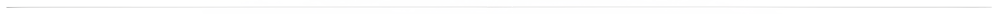
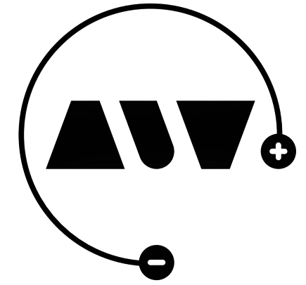
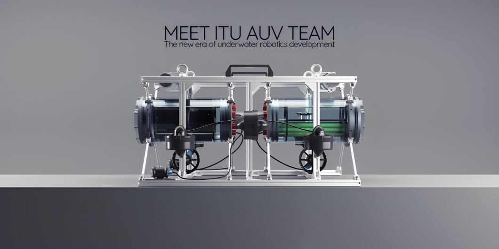
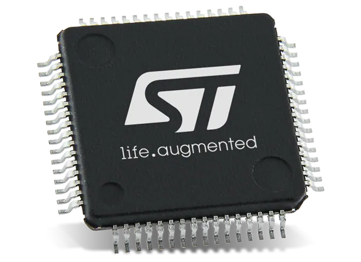

# WARP Driver Board Firmware 

WARP is the dedicated motor driver and power distribution board that powers our Autonomous Underwater Vehicle (AUV). The firmware is specifically developed for the Cortex series STM32F401 microcontroller. With the integration of the real-time operating system, FreeRTOS, it coherently and responsively organizes complex tasks such as motor driving and power monitoring.

This repository focuses Warp's firmware. For more details on the hardware, visit the [Warp Hardware Repository](https://github.com/onur-ulusoy/AUV-Warp-Driver-Board).

<picture>    </picture>

    

<em >AUV Electronics 2022</em>

<picture>    </picture>

    

<picture>    </picture>

    

<picture>    </picture>

    </a>

 

<em >STM32F401 Cortex</em>

<picture>    </picture>

)

