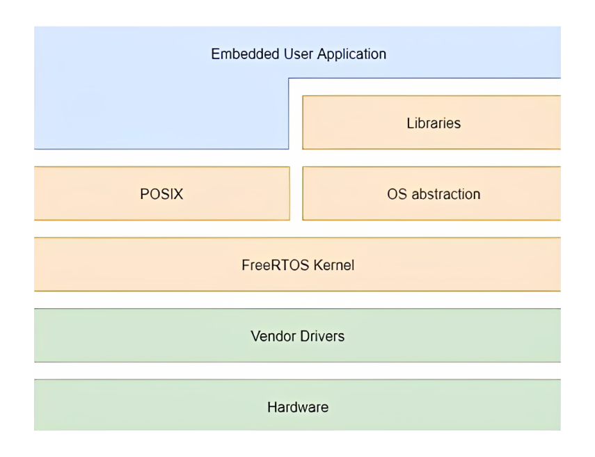
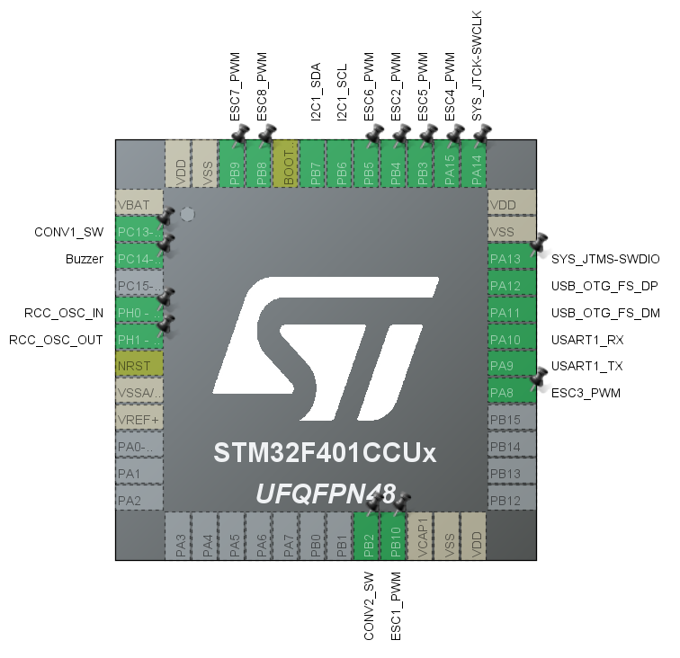
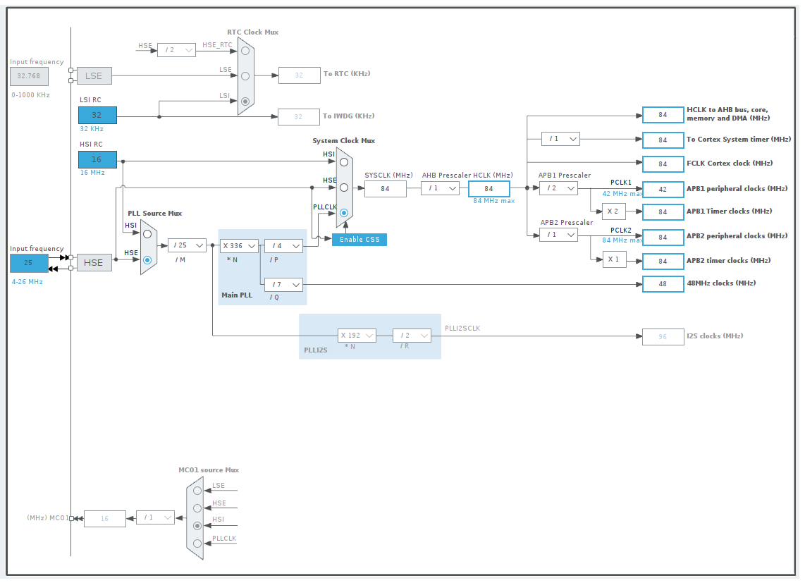
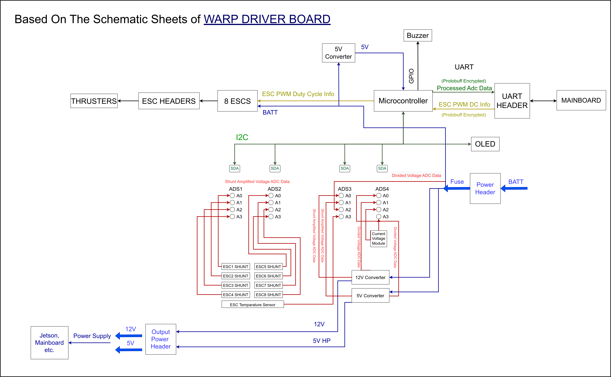

# WARP Driver Board Firmware 

WARP is the dedicated motor driver and power distribution board that powers our Autonomous Underwater Vehicle (AUV). The firmware is specifically developed for the Cortex series STM32F401 microcontroller. With the integration of the real-time operating system, FreeRTOS, it coherently and responsively organizes complex tasks such as motor driving and power monitoring.

This repository focuses Warp's firmware. For more details on the hardware, visit the [Warp Hardware Repository](https://github.com/onur-ulusoy/AUV-Warp-Driver-Board).


<picture>    </picture>

<p align="center">
    <a href="https://auv.itu.edu.tr/">
        
    </a>
</p>


<p align="center"><em >AUV Electronics 2022</em></p>


<picture>    </picture>


<p align="center">
    <a href="https://auv.itu.edu.tr/">
        
    </a>
</p>


<picture>    </picture>

<p align="center">
    
</p>

<picture>    </picture>


<p align="center">
    
</p>


<p align="center"><em >STM32F401 Cortex</em></p>

<picture>    </picture>


[](https://www.apache.org/licenses/LICENSE-2.0.html)
[](https://www.st.com/en/microcontrollers-microprocessors/stm32f401.html)
[](https://www.freertos.org)
[](https://en.wikipedia.org/wiki/C_(programming_language))
[](https://github.com/onur-ulusoy/AUV-Warp-Firmware/actions/workflows/make.yml)


## Table of Contents
- [WARP Driver Board Firmware](#warp-driver-board-firmware)
  - [Table of Contents](#table-of-contents)
  - [Board Description](#board-description)
  - [Architecture](#architecture)
    - [Interrupts](#interrupts)
    - [Real Time Tasks](#real-time-tasks)
    - [Pinout](#pinout)
    - [Clock Configurations](#clock-configurations)
    - [Other Connections](#other-connections)
  - [Dependencies](#dependencies)
  - [Build \& Flash](#build--flash)
    - [Rebuild Script](#rebuild-script)
  - [Technologies Used](#technologies-used)
  - [Project Timeline](#project-timeline)
  - [LICENSE](#license)

## Board Description

The Warp Driver Board manages the direction movements of the underwater vehicle. It controls the brushless AC motors, connected to the propellers known as Thrusters, with PWM signals via integrated circuits called ESCs, based on commands received from the vehicle's onboard computer NVDIA Jetson Xavier. The commands are transmitted from the computer to the main board, then to the driver board, with the conversion of the UART signal to RS232 signal in the form of protobuf encrypted data.

The secondary, but equally crucial, function of the Warp Driver Board is to manage power distribution. It stabilizes the 14-16 Volt input from the battery and provides steady 12V and 5V outputs to other electronic components, the onboard computer, and various peripherals. The Warp Driver Board also includes a secondary 5V regulator to control the voltage supplied to its onboard microcontroller. 

The board is designed with safety and efficiency in mind. It includes a 100A fuse at the battery input and can measure current/voltage in various areas using integrated ADCs, thereby shutting down the vehicle in case of danger. To accurately measure voltages, it utilizes shunt resistors and voltage dividers. Critical data about current, voltage, and temperatures at key points are displayed on an LCD screen. 


<p align="center">
    
</p>

## Architecture

The firmware is built on a layered architecture, employing the FreeRTOS kernel on top of other layers like hardware abstraction layer (HAL) and more.


<p align="center">
    
</p>


_Image and the below info are taken from [PiEmbsysTech](https://piembsystech.com/free-rtos/)_

The architecture of the firmware based on FreeRTOS consists of the following layers:

- **Hardware Abstraction Layer (HAL):** The HAL layer serves as an interface between the hardware and the operating system. This layer comprises device drivers, interrupt handlers, and other functions that are specific to the hardware.

- **Kernel:** The kernel layer, the core of the operating system, provides the scheduling and task management functions. This layer consists of the task scheduler, task management, memory management, synchronization mechanisms, and interrupt handling.

- **Application Programming Interface (API):** The API layer offers a collection of functions that can be used by the application for the creation, deletion, and management of tasks. Additionally, it also manages shared resources and synchronizes tasks.

- **Application Code:** This layer contains the user application code that operates atop the operating system. The development of this layer is possible using standard programming languages such as C and C++.

### Interrupts 

The firmware leverages various interrupts for specific functionalities, such as:

- **HAL_UART_RxCpltCallback**: This interrupt fills the `WarpCommand` struct with PWM information that has been encapsulated using Protocol Buffers (protobufs) and received from the onboard computer via UART. Protobufs is a language-neutral, platform-neutral, extensible mechanism for serializing structured data developed by Google.

### Real Time Tasks

The firmware comprises several tasks, each contributing to a distinct functionality. They include:

- **MotorDrive:** This task drives motors using PWMs from the `WarpCommand` struct, which are encoded and decoded in protobufs. This task is prioritized at level 2. PWM duty cycles arranged according to the rule for Bluerobotics ESC's from this document: [pwm frequencies](/docs/pwm%20frequencies.pdf).

- **SensorRead:** This task reads sensor data from ADC sensors via I2C. If necessary, it can halt the microcontroller, including power distribution, from converter switches. The priority level for this task is 1

- **Monitoring:** This task transmits sensor data and other monitoring related data to the onboard computer via UART. The transmitted data is encapsulated using protobufs. In addition, it also controls the buzzer and OLED for notifications. This task is assigned a priority level of 3.


### Pinout

The pinout diagram, generated using STM32CubeMX, is available [ioc file](warp_firmware.ioc) and can be seen below:

<p align="center">
    
</p>


Definitions of pins referenced in diagram are below.

<div align="center">

| Exported Pins | Description                  |
| ------------- | ---------------------------- |
| CONV1_SW      | Converter 1 Switch Pin       |
| CONV2_SW      | Converter 2 Switch Pin       |
| ESC1_PWM      | ESC1 Pulse Pin               |
| ESC2_PWM      | ESC2 Pulse Pin               |
| ESC3_PWM      | ESC3 Pulse Pin               |
| ESC4_PWM      | ESC4 Pulse Pin               |
| ESC5_PWM      | ESC5 Pulse Pin               |
| ESC6_PWM      | ESC6 Pulse Pin               |
| ESC7_PWM      | ESC7 Pulse Pin               |
| ESC8_PWM      | ESC8 Pulse Pin               |
| USART1 RX     | RS232 RX Pin on the PCB      |
| USART1 TX     | RS232 TX Pin on the PCB      |
| Buzzer        | Buzzer on the PCB            |
| USB Device    | Micro USB on PCB             |

</div>

### Clock Configurations

The STM32F401 microcontroller's clock configuration is illustrated below. It is set up and configured using the STM32CubeMX software. This diagram was also created using STM32CubeMX.

<div align="center">
  
</div>

This setup involves a High-Speed Internal (HSI) clock, which is divided down for various purposes including for the system clock and for the peripheral clocks. It's worth noting that this clock configuration can be adjusted in the CubeMX software, depending on the specific needs of the AUV. Please refer to the STM32F401's datasheet and reference manual for more details on clock configurations.


### Other Connections

The other connections includes all the PCB's power distribution and communication can be seen below schematic. Note that you may want to examine this clicking and zooming in.


<p align="center">
    
</p>


## Dependencies

This firmware requires the following dependencies:

1. GCC ARM Embedded Toolchain: For compiling the source code.
2. Make: For automating the build process.
3. OpenOCD: A debugger and firmware flashing tool for on-chip debugging, in-system programming, and boundary-scan testing.

To install these dependencies on a Debian-based system, use the following commands:

```bash
sudo apt-get update
sudo apt-get install gcc-arm-none-eabi make openocd
```

## Build & Flash
To build the project, navigate to the project directory and run
```bash
make
```

To flash the firmware to the STM32F401 microcontroller, connect the microcontroller to your machine,
then run the appropriate command based on your flashing tool. Here's an example using OpenOCD:
```bash
openocd -f interface/stlink.cfg -f target/stm32f4x.cfg -c "program ./build/warp_firmware.elf verify reset exit"
```

### Rebuild Script
Here's an additional [bash script](/rebuild.bash) you can use to build the project. It offers the following features:

- Argument Parsing: It can accept arguments like --v for verbose output.
- Build Cleaning: It clears out any previous builds before starting a new one.
- Color-Coded Output: Errors and warnings are highlighted in red and yellow respectively, for easy identification.
- Exit Status: It displays whether the build was successful or failed, after completion.

The script can be used:

```bash
source rebuild.bash
```

or verbose mode, only errors will show up

```bash
source rebuild.bash --v
```

## Technologies Used

The following technologies and software were used in the development of the WARP firmware:

- [VS Code](https://code.visualstudio.com/): A powerful source code editor with essential addons, providing an impeccable development experience.
  
- [GNU Make](https://www.gnu.org/software/make/): A powerful tool which enables developers to maintain groups of programs.
  
- [STM32CubeMX](https://www.st.com/en/development-tools/stm32cubemx.html): A graphical software configuration tool that allows the generation of C initialization code using graphical wizards.
  
- [FreeRTOS](https://www.freertos.org/): A real-time operating system for microcontrollers, providing robust functionality for embedded systems.
  
- [Git](https://git-scm.com/): A distributed version control system for tracking changes in any set of files, originally designed for coordinating work among programmers.
  
- [CLion](https://www.jetbrains.com/clion/): A cross-platform IDE for C and C++ by JetBrains.
  
- [STM32CubeIDE](https://www.st.com/en/development-tools/stm32cubeide.html): An integrated development environment used for STM32 microcontroller development, based on the Eclipse platform.
  
- [Protocol Buffers (protobuf)](https://developers.google.com/protocol-buffers): Google's language-neutral, platform-neutral, extensible mechanism for serializing structured data.
  
- [Saleae Logic Analyzer Software](https://www.saleae.com/): A logic analyzer and signal recorder software used for testing and verifying digital signals, essential for analyzing PWM signals.
  
- [Draw.io](https://www.drawio.com/): A free online diagram software for creating any types of diagrams and flowcharts.

## Project Timeline
The AUV warp driver board firmware handled by electronics team, developed and maintained under the leadership of Onur Ulusoy, was initiated in December 2021 and end up in August 2022. Detailed progress and contributions during this period remain within the team's internal documentation. Task sharing and reporting was applied using the platform Trello. The team strived for comprehensive hardware and firmware development, ensuring integration and performance of the Autonomous Underwater Vehicle (AUV).

## LICENSE
Project including all the source code is licensed under the Apache License 2.0.

For detailed information, refer to the [LICENSE](LICENSE) file in this repository.


