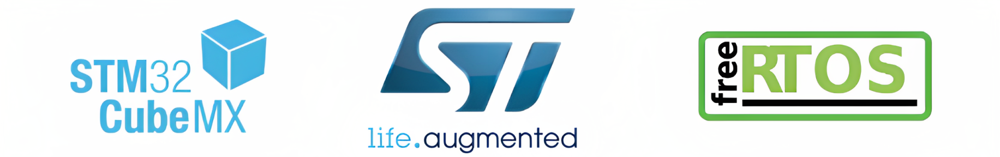

# WARP Driver Board Firmware 

WARP is the dedicated motor driver and power distribution board that powers our Autonomous Underwater Vehicle (AUV). The firmware is specifically developed for the Cortex series STM32F401 microcontroller. With the integration of the real-time operating system, FreeRTOS, it coherently and responsively organizes complex tasks such as motor driving and power monitoring.

This repository focuses Warp's firmware. For more details on the hardware, visit the [Warp Hardware Repository](https://github.com/onur-ulusoy/AUV-Warp-Driver-Board).

<picture>    </picture>

    

<em >AUV Electronics 2022</em>

<picture>    </picture>

    

<picture>    </picture>

    

<picture>    </picture>

    </a>

 

<em >STM32F401 Cortex</em>

<picture>    </picture>

)

## Table of Contents
- [WARP Driver Board Firmware](#warp-driver-board-firmware)
  - [Table of Contents](#table-of-contents)
  - [Board Description](#board-description)
  - [Architecture](#architecture)

## Board Description

The Warp Driver Board manages the direction movements of the underwater vehicle. It controls the brushless AC motors, connected to the propellers known as Thrusters, with PWM signals via integrated circuits called ESCs, based on commands received from the vehicle's onboard computer NVDIA Jetson Xavier. The commands are transmitted from the computer to the main board, then to the driver board, with the conversion of the UART signal to RS232 signal in the form of protobuf encrypted data.

The secondary, but equally crucial, function of the Warp Driver Board is to manage power distribution. It stabilizes the 14-16 Volt input from the battery and provides steady 12V and 5V outputs to other electronic components, the onboard computer, and various peripherals. The Warp Driver Board also includes a secondary 5V regulator to control the voltage supplied to its onboard microcontroller. 

The board is designed with safety and efficiency in mind. It includes a 100A fuse at the battery input and can measure current/voltage in various areas using integrated ADCs, thereby shutting down the vehicle in case of danger. To accurately measure voltages, it utilizes shunt resistors and voltage dividers. Critical data about current, voltage, and temperatures at key points are displayed on an LCD screen. 

    

## Architecture

The firmware is built on a layered architecture, employing the FreeRTOS kernel on top of other layers like hardware abstraction layer (HAL) and more.

    

_Image and the below info are taken from [PiEmbsysTech](https://piembsystech.com/free-rtos/)_

The architecture of the firmware based on FreeRTOS consists of the following layers:

- **Hardware Abstraction Layer (HAL):** The HAL layer serves as an interface between the hardware and the operating system. This layer comprises device drivers, interrupt handlers, and other functions that are specific to the hardware.

- **Kernel:** The kernel layer, the core of the operating system, provides the scheduling and task management functions. This layer consists of the task scheduler, task management, memory management, synchronization mechanisms, and interrupt handling.

- **Application Programming Interface (API):** The API layer offers a collection of functions that can be used by the application for the creation, deletion, and management of tasks. Additionally, it also manages shared resources and synchronizes tasks.

- **Application Code:** This layer contains the user application code that operates atop the operating system. The development of this layer is possible using standard programming languages such as C and C++.

